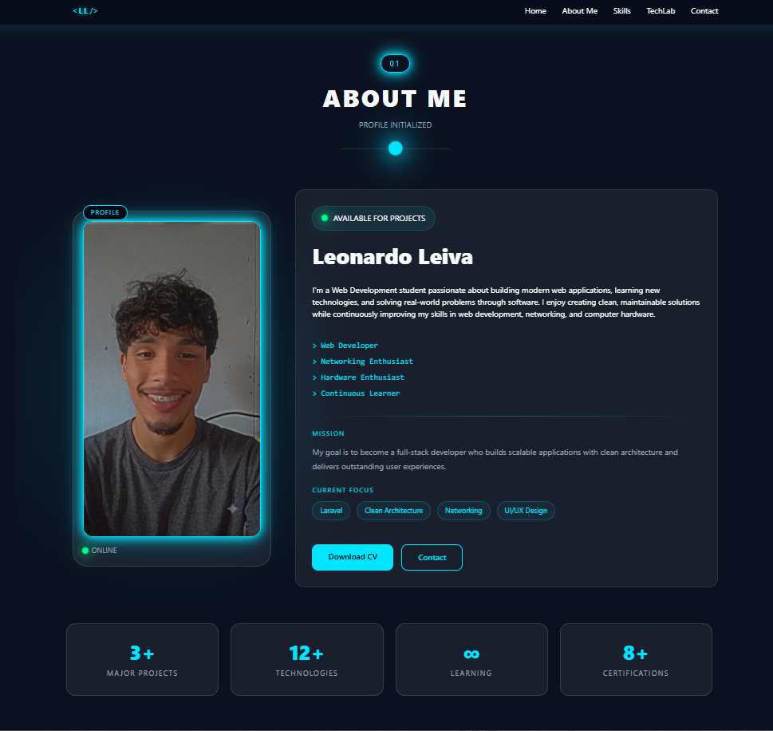
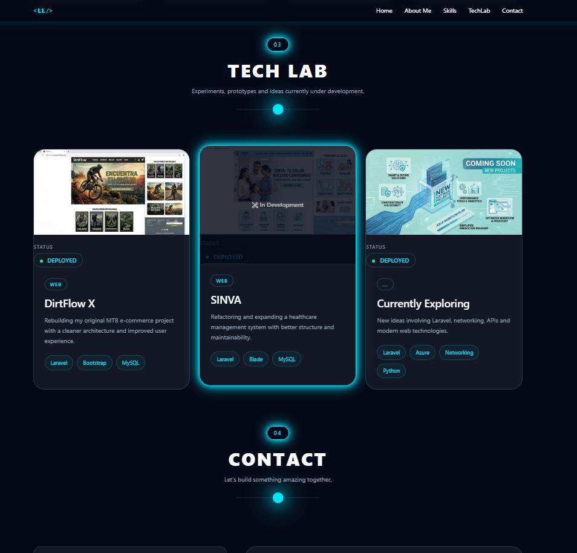
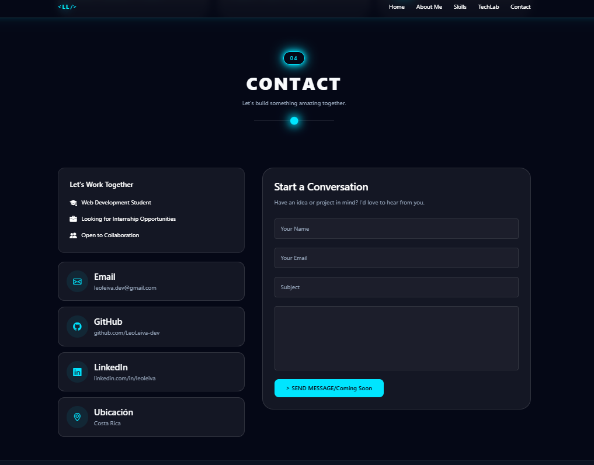

# Portfolio Web - Leonardo Leiva

Personal developer portfolio built with Laravel to showcase my projects, technical skills and experience as a web developer.

This project represents my journey as a developer, applying modern web development practices with Laravel and related technologies.

## 🚀 Technologies

- PHP
- Laravel
- MySQL
- Bootstrap
- JavaScript
- CSS
- Git & GitHub

## ✨ Features

- Responsive design
- Developer profile presentation
- Project showcase
- Contact section
- Modern UI with custom styling
- MVC architecture with Laravel

## 📂 Project Structure

This project follows the MVC (Model-View-Controller) architecture pattern provided by Laravel.

## 📷 Preview

### About Me Section



### Projects Section



### Contact Section



## 🛠️ Development Environment

This project was developed using:

- Laravel Herd
- PHP
- MySQL
- DBngin
- DBeaver
- Node.js & npm
- Git & GitHub

## ⚙️ Installation

Clone the repository:

```bash
git clone https://github.com/LeoLeiva-dev/portfolio.git


